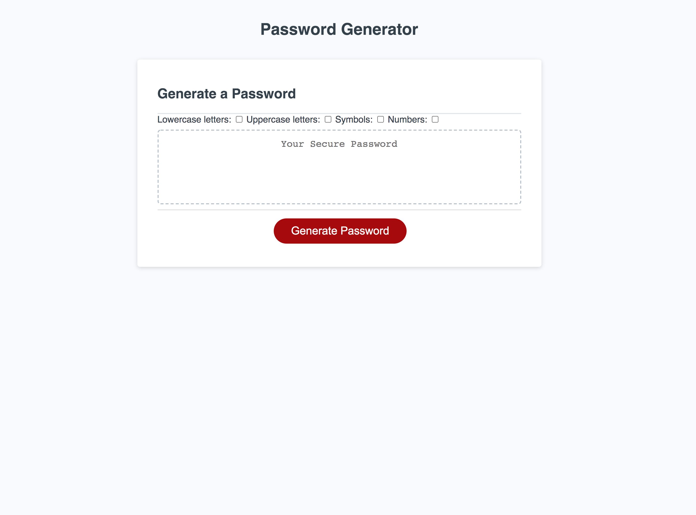

## README.md

RANDOM PASSWORD GENERATOR

Description:
A random password generator. 
When the button to generate a password is clicked, a series of prompts for password criteria are presented. The prompts ask for the type of characters to include and the password length. 
The password length must by between 8 and 128 characters. 
The input is then validated.
At least one character of each selected type is included in the generated password. 
The password is diplayed inside a text box. 

Screenshot:
The following image demonstrates the application functionality:

Link to deployed application:

https://blakestickland.github.io/password-generator/

Challenges: 
* Working out how to randomize the sequentially generated random password took some time. 
* Displaying the text in the text area was a challenge.

For future development:
* Replace the check boxes, which are a misleading in that they only deisplay the result of the confirm messages. Instead, could display the user selected criteria in a text area including stating the length of the password.
* Redesign the password generator so that one character from each chosen character array is selected, then the rest of the password is generated completely randomly from a concatenated set. 
