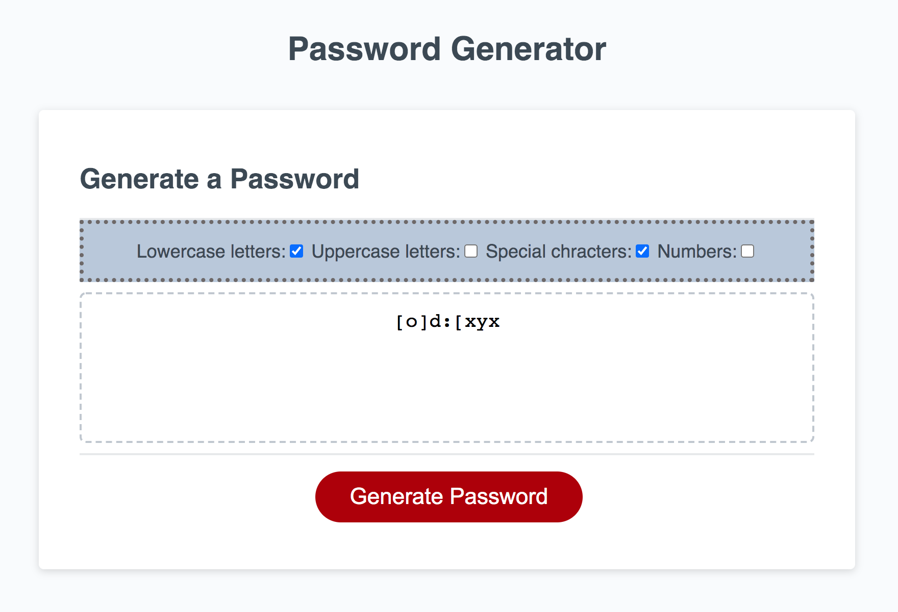

## README.md

RANDOM PASSWORD GENERATOR

Description:
A random password generator. 
When the button to generate a password is clicked, a series of prompts for password criteria are presented. The prompts ask for the type of characters to include and the password length. 
The password length must by between 8 and 128 characters. 
The input is then validated.
At least one character of each selected type is included in the generated password. 
The password is diplayed inside a text box. 

Screenshot:
The following image demonstrates the application functionality:



Link to deployed application:


## User Story

```
AS AN employee with access to sensitive data
I WANT to randomly generate a password that meets certain criteria
SO THAT I can create a strong password that provides greater security
```

## Acceptance Criteria

```
GIVEN I need a new, secure password
WHEN I click the button to generate a password
THEN I am presented with a series of prompts for password criteria
WHEN prompted for password criteria
THEN I select which criteria to include in the password
WHEN prompted for the length of the password
THEN I choose a length of at least 8 characters and no more than 128 cha
WHEN prompted for character types to include in the password
THEN I choose lowercase, uppercase, numeric, and/or special characters
WHEN I answer each prompt
THEN my input should be validated and at least one character type should
WHEN all prompts are answered
THEN a password is generated that matches the selected criteria
WHEN the password is generated
THEN the password is either displayed in an alert or written to the page


** to work on next 

-- need to shuffle the array.

-- need to change array to string.

-- need to get password string into the text box. 

-- need to check the loops will choose from correct set.
 remember zero index and value assigned to "x" or "i"

 -- need to turn check boxes to ticks if confirm() returns true.
